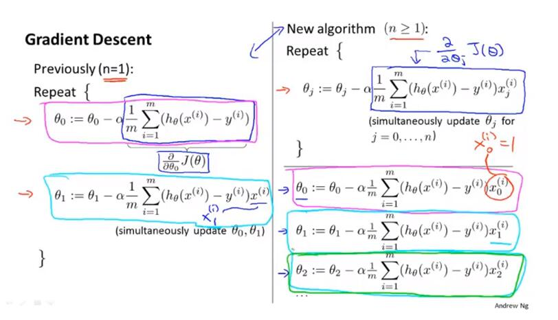

# **Python**
- pop方法是唯一一个**既能修改列表又返回元素值（除了None）的列表方法**
- 考虑实现一个先进先出的队列，可以**采用insert(0,...)来代替append方法**。或者，也可以**继续使用append方法，但必须用pop(0)代替pop()**。更好的解决方案是**使用collection模块中的deque对象**。

---

# **KNN**
- k近邻算法的输入为**实例的特征向量**，对应于**特征空间的点**；**输出为实例的类别**，可以取多类。
- k近邻算法的三个基本要素：**k值的选择、距离度量以及分类决策规则**。
- 归一化处理：归一化就是要**把你需要处理的数据经过处理后（通过某种算法）限制在你需要的一定范围内**。
- KNN算法没有必要进行训练操作的原因：**因为测试数据每一次都要与全量的训练数据进行比较，所以这个过程是没有必要的**。

# **决策树**
## **决策树的定义**
- 分类决策树模型是一种描述**对实例进行分类的树形结构**。决策树**由结点**(node)和**有向边**（directed edge）组成。结点有两种类型：**内部结点**（internal node）和**叶结点**（leaf node）.**内部结点表示一个特征或属性值（features）**，**叶结点表示一个类**（labels)。
- 用决策树对需要测试的实例进行分类:**从根节点开始，对实例的某一特征进行测试，根据测试结果，将实例分配到其子结点**;这时，**每一个子结点对应着该特征的一个取值.如此递归地对实例进行测试并分配，直至达到叶结点.最后将实例分配到叶结点的类中**。

## **决策树的开发流程**
- 收集数据：可以使用任何方法。
- 准备数据：**树构造算法**（这里使用的是**ID3算法，只适用于标称型数据**，这就是为什么**数值型数据必须离散化**.还有其他的树构造算法，比如CART)
- 分析数据：可以使用任何方法，构造树完成之后，我们应该检查图形是否符合预期.
- 训练算法：构造树的数据结构。
- 测试算法：使用训练好的树计算错误率。
- 使用算法：此步骤可以适用于任何监督学习任务，而使用决策树可以更好地理解数据的内在含义。

## 代价函数
- 

## 梯度下降算法
- 

## 线性回归算法
- 

## 多元线性回归
- x=[x0,x1,x2,x3,x4...],Q=[Q^0,Q^1,Q^2...],
- hΘ(x)=Q^T*x=Q^0x^0+Q^1x^1+Q^2x^2+...+Q^nx^n;
- 
## 特征收敛
- 可以让等值曲线下降的更加快，即收敛的更快，对x0，x1放缩到接近-1=<x<=1。

## 均值统一化
- 

## 正规方程
- 
1. 正规方程，可以一步得到回归问题的最优解。
1. 牢记正规方程 θ=(X'X)^{-1}X'y，可使θ最优化。
2. 正规方程不需要进行特征缩放。
3. 正规方程需要计算矩阵(X'X)^{-1}，其纬度是nxn，它的计算复杂度是O(n^3)。当n<=10000时，用正规方程计算是合适的，超过一万，计算机计算就会很慢。
4. 梯度下降法适用于百万级别的特征数量。

- 使用正规方程就不需要进行特征缩放。
1. X'X不可逆的情况其实很少发生
2. 数值计算。pinv伪逆，inv逆。
3. 出现矩阵不可逆的情况：
    a) 多余的特征参数。造成线性相关。
    b) 太多的特征参数，相对的，样本过少 m<=n。删除过多的特征参数，或正规化处理。
## logistic回归
- 

- **代价函数**：
- 

- **梯度下降算法**：
- 