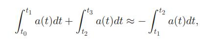

## **对称重复序列检测法**
- After the system detects an eligible semi-wave which starts at t0 and ends at t1, it looks for the next eligible semi-wave with peak or valley between t1 and t1+（t1-t0）. If it is found, there is a single lane-change. If not, the system continues to look for an eligible semi-wave with peak or valley between t2 (t1<=t2<=2t1-t0) andt2+(t1-t0).
- **在t1时刻检测到一个有效的从t0开始到t1的半波，就在t1到t1+（t1-t0）内继续寻找下一个有效的波峰或波谷，如果找到了，就判断有一个变道动作，没有的话，系统继续在t2(t1<=t2<=2t1-t0)和t2+(t1-t0)之间查找波峰或者波谷**。

## **变道检测法**
### **单变道序列检测法**
- 横向加速度与时间的积分是横向的速度差，所以在做完变道动作之后以及开始做变道的时候的横向速度应该都是0，因此，两个半波的面积绝对值应该相同，由公式表示如下:$∫t0t1a(t)dt≈-∫t1t2a(t)dt$.

### **胚胎序列检测法**
- 在胚胎序列变道检测法中，第一个半波从t0开始到t1，第二个从t1开始到t2，第三个半波从t2到t3.积分公式如下：
- 